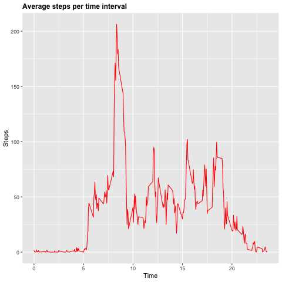

## Assignment Instructions

1. Code for reading in the dataset and/or processing the data.
2. Histogram of the total number of steps taken each day.
3. Mean and median number of steps taken each day.
4. Time series plot of the average number of steps taken
5. The 5-minute interval that, on average, contains the maximum number of steps.
6. Code to describe and show a strategy for imputing missing data.
7. Histogram of the total number of steps taken each day after missing values are imputed.
8. Panel plot comparing the average number of steps taken per 5-minute interval across weekdays and    weekends.
9. All of the R code needed to reproduce the results (numbers, plots, etc.) in the report 

***
## Loading and preprocessing the data
**1. Code for reading the dataset and/or processing the data.**

```r
# Libraries
library(ggplot2)
library(dplyr)
library(lubridate)
```

```r
#Loading and reading data
setwd("~/Documents/GitHub/RepData_PeerAssessment1/RepData_PeerAssessment1")
unzip("./activity.zip")
activityData <- read.csv("./activity.csv")
```

```r
#Exploring the datset
dim(activityData)
names(activityData)
head(activityData)
str(activityData)
```

```r
#Transforming the date column into date format 
activityData$date<-ymd(activityData$date)
length(unique(activityData$date))
summary(activityData)
```
The variables included in this dataset are:
* steps: Number of steps taking in a 5-minute interval (missing values are coded as NA).  
* date: The date on which the measurement was taken.  
+ interval: Identifier for the 5-minute interval in which measurement was taken.  

**2. Histogram of the total number of steps taken each day.**

```r
# Calculate number of steps per day
StepsPerDay <- aggregate(activityData$steps, list(activityData$date), FUN=sum)
colnames(StepsPerDay) <- c("Date", "Steps")
```

```r
# draw the histogram 
g <- ggplot(StepsPerDay, aes(Steps))
g+geom_histogram(boundary=0, binwidth=2500, col="grey", fill="darkblue") + ggtitle("Histogram of steps per day")+xlab("Steps")+ylab("Frequency")+theme(plot.title = element_text(face="bold", size=12))+scale_x_continuous(breaks=seq(0,25000,2500))+scale_y_continuous(breaks=seq(0,18,2))
```

<!-- -->

## What is mean total number of steps taken per day?
**3. Mean and median number of steps taken each day.**

```r
# Mean
mean(StepsPerDay$Steps, na.rm=TRUE)
```

```
## [1] 10766.19
```

```r
#Median
median(StepsPerDay$Steps, na.rm=TRUE)
```

```
## [1] 10765
```
## What is the average daily activity pattern?
**4. Time series plot of the average number of steps taken**

```r
# create table with steps per time
StepsPerTime <- aggregate(steps~interval,data=activityData,FUN=mean,na.action=na.omit)

# variable time (more comprensible for the graph axis)
StepsPerTime$time <- StepsPerTime$interval/100

# draw the line plot
png("plot1.png")
h <- ggplot(StepsPerTime, aes(time, steps))
h+geom_line(col="red")+ggtitle("Average steps per time interval")+xlab("Time")+ylab("Steps")+theme(plot.title = element_text(face="bold", size=12))
dev.off()
```

```
## quartz_off_screen 
##                 2
```



