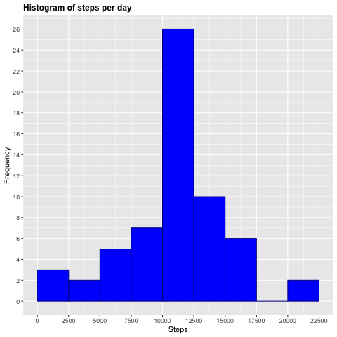

## Assignment Instructions

1. Code for reading in the dataset and/or processing the data.
2. Histogram of the total number of steps taken each day.
3. Mean and median number of steps taken each day.
4. Time series plot of the average number of steps taken
5. The 5-minute interval that, on average, contains the maximum number of steps.
6. Code to describe and show a strategy for imputing missing data.
7. Histogram of the total number of steps taken each day after missing values are imputed.
8. Panel plot comparing the average number of steps taken per 5-minute interval across weekdays and    weekends.
9. All of the R code needed to reproduce the results (numbers, plots, etc.) in the report 

***


## Loading and preprocessing the data
**1. Code for reading the dataset and/or processing the data.**

```r
# Libraries
library(ggplot2)
library(dplyr)
library(lubridate)
```

```r
#Loading and reading data
setwd("~/Documents/GitHub/RepData_PeerAssessment1/RepData_PeerAssessment1")
unzip("./activity.zip")
activityData <- read.csv("./activity.csv")
```

```r
#Exploring the datset
dim(activityData)
names(activityData)
head(activityData)
str(activityData)
```

```r
#Transforming the date column into date format 
activityData$date<-ymd(activityData$date)
length(unique(activityData$date))
summary(activityData)
```
The variables included in this dataset are:
* steps: Number of steps taking in a 5-minute interval (missing values are coded as NA).  
* date: The date on which the measurement was taken.  
+ interval: Identifier for the 5-minute interval in which measurement was taken.  

**2. Histogram of the total number of steps taken each day.**

```r
# Calculate number of steps per day
StepsPerDay <- aggregate(activityData$steps, list(activityData$date), FUN=sum)
colnames(StepsPerDay) <- c("Date", "Steps")
```

```r
# draw the histogram 
png("hist1.png")
g <- ggplot(StepsPerDay, aes(Steps))
g+geom_histogram(boundary=0, binwidth=2500, col="grey", fill="darkblue") + ggtitle("Histogram of steps per day")+xlab("Steps")+ylab("Frequency")+theme(plot.title = element_text(face="bold", size=12))+scale_x_continuous(breaks=seq(0,25000,2500))+scale_y_continuous(breaks=seq(0,18,2))
dev.off()
```


## What is mean total number of steps taken per day?
**3. Mean and median number of steps taken each day.**

```r
# Mean
mean(StepsPerDay$Steps, na.rm=TRUE)
```

```
## [1] 10766.19
```

```r
#Median
median(StepsPerDay$Steps, na.rm=TRUE)
```

```
## [1] 10765
```
## What is the average daily activity pattern?
**4. Time series plot of the average number of steps taken**

```r
# create table with steps per time
StepsPerTime <- aggregate(steps~interval,data=activityData,FUN=mean,na.action=na.omit)

# variable time (more comprensible for the graph axis)
StepsPerTime$time <- StepsPerTime$interval/100

# draw the line plot
png("plot1.png")
h <- ggplot(StepsPerTime, aes(time, steps))
h+geom_line(col="red")+ggtitle("Average steps per time interval")+xlab("Time")+ylab("Steps")+theme(plot.title = element_text(face="bold", size=12))
dev.off()
```


## Imputing missing values
**6. Code to describe and show a strategy for imputing missing data.**  
Total number of missing values in the dataset  

```r
# table for dplyr
ACT <- tbl_df(activityData)
# find the column
ACT %>% filter(is.na(steps)) %>% summarize(missing_values = n())
```

```
## # A tibble: 1 x 1
##   missing_values
##            <int>
## 1           2304
```

Replace missing values  
The rounded values of the average 5-minute interval is used to replace the NA values.  
CompleteSteps is the new column without missing values.

```r
# values for NA are imputed in a new column
activityData$CompleteSteps <- ifelse(is.na(activityData$steps), round(StepsPerTime$steps[match(activityData$interval, StepsPerTime$interval)],0), activityData$steps)
```
New dataset that is equal to the original dataset but with the missing data filled in.  
The first ten values of the new dataset are shown below.


```r
# new dataset activityFull
activityFull <- data.frame(steps=activityData$CompleteSteps, interval=activityData$interval, date=activityData$date)
# see first 10 values of the new dataset
head(activityFull, n=10)
```

```
##    steps interval       date
## 1      2        0 2012-10-01
## 2      0        5 2012-10-01
## 3      0       10 2012-10-01
## 4      0       15 2012-10-01
## 5      0       20 2012-10-01
## 6      2       25 2012-10-01
## 7      1       30 2012-10-01
## 8      1       35 2012-10-01
## 9      0       40 2012-10-01
## 10     1       45 2012-10-01
```

**7. Histogram of the total number of steps taken each day after missing values are imputed.**

```r
# prepare data
StepsPerDayFull <- aggregate(activityFull$steps, list(activityFull$date), FUN=sum)
colnames(StepsPerDayFull) <- c("Date", "Steps")
# draw the histogram
png("hist2.png")
g <- ggplot(StepsPerDayFull, aes(Steps))
g+geom_histogram(boundary=0, binwidth=2500, col="darkblue", fill="blue")+ggtitle("Histogram of steps per day")+xlab("Steps")+ylab("Frequency")+theme(plot.title = element_text(face="bold", size=12))+scale_x_continuous(breaks=seq(0,25000,2500))+scale_y_continuous(breaks=seq(0,26,2))
dev.off()
```
  

Mean and median total number of steps taken per day with the missing values filled in.


```r
# Mean
mean(StepsPerDayFull$Steps)
```

```
## [1] 10765.64
```

```r
#Median
median(StepsPerDayFull$Steps)
```

```
## [1] 10762
```

## Are there differences in activity patterns between weekdays and weekends?
**8. Panel plot comparing the average number of steps taken per 5-minute interval across weekdays and    weekends.**  

New variables for weekend and weekdays.  

```r
# Create variable with date in correct format
activityFull$RealDate <- as.Date(activityFull$date, format = "%Y-%m-%d")
# create a variable with weekdays name
activityFull$weekday <- weekdays(activityFull$RealDate)
# create a new variable indicating weekday or weekend
activityFull$DayType <- ifelse(activityFull$weekday=='Saturday' | activityFull$weekday=='Sunday', 'weekend','weekday')
# see first 10 values
head(activityFull, n=10)
```

```
##    steps interval       date   RealDate weekday DayType
## 1      2        0 2012-10-01 2012-10-01  Monday weekday
## 2      0        5 2012-10-01 2012-10-01  Monday weekday
## 3      0       10 2012-10-01 2012-10-01  Monday weekday
## 4      0       15 2012-10-01 2012-10-01  Monday weekday
## 5      0       20 2012-10-01 2012-10-01  Monday weekday
## 6      2       25 2012-10-01 2012-10-01  Monday weekday
## 7      1       30 2012-10-01 2012-10-01  Monday weekday
## 8      1       35 2012-10-01 2012-10-01  Monday weekday
## 9      0       40 2012-10-01 2012-10-01  Monday weekday
## 10     1       45 2012-10-01 2012-10-01  Monday weekday
```

```r
# create table with steps per time across weekdaydays or weekend days
StepsPerTimeDT <- aggregate(steps~interval+DayType,data=activityFull,FUN=mean,na.action=na.omit)
# variable time (more comprensible for the graph axis)
StepsPerTimeDT$time <- StepsPerTime$interval/100

# draw the line plot
png("plot2.png")
j <- ggplot(StepsPerTimeDT, aes(time, steps))
j+geom_line(col="red")+ggtitle("Average steps per time interval: weekdays vs. weekends")+xlab("Time")+ylab("Steps")+theme(plot.title = element_text(face="bold", size=12))+facet_grid(DayType ~ .)
dev.off()
```

